# PeatLearn: The Complete Documentary

> A beginner-friendly, illustrated guide to every part of the PeatLearn platform.
> Written so that someone with basic computer science knowledge can understand the entire system.

---

## Table of Contents

1. [What Is PeatLearn?](#1-what-is-peatlearn)
2. [The Big Picture — How Everything Connects](#2-the-big-picture)
3. [The Three Servers — Your Application's Brain, Heart, and Face](#3-the-three-servers)
4. [The Data Pipeline — From Raw Text to Smart Search](#4-the-data-pipeline)
5. [The RAG System — How the Chatbot Answers Questions](#5-the-rag-system)
6. [The Adaptive Learning System — Personalised Education](#6-the-adaptive-learning-system)
7. [The Personalization Engine — Machine Learning at Work](#7-the-personalization-engine)
8. [The Recommendation System — Matrix Factorization](#8-the-recommendation-system)
9. [The Knowledge Graph — Connecting Concepts](#9-the-knowledge-graph)
10. [The Reinforcement Learning Agent — Learning to Teach](#10-the-reinforcement-learning-agent)
11. [The Frontend — What the User Sees](#11-the-frontend)
12. [Configuration and Secrets](#12-configuration-and-secrets)
13. [Testing — Making Sure It All Works](#13-testing)
14. [Key Algorithms Explained](#14-key-algorithms-explained)
15. [File-by-File Reference](#15-file-by-file-reference)
16. [Glossary](#16-glossary)
17. [Future Plans — LLM Fine-Tuning](#17-future-plans--llm-fine-tuning)

---

## 1. What Is PeatLearn?

### The Short Version

PeatLearn is a **web application** that helps people learn about Dr. Ray Peat's ideas on health, nutrition, and biology. Think of it as a smart tutor that:

- **Answers questions** by searching through hundreds of Dr. Peat's writings and interviews
- **Gives quizzes** that adapt to how well you're learning
- **Tracks your progress** and personalises what you see next
- **Gets smarter** the more you use it

### What Makes It "AI-Powered"?

PeatLearn uses several types of artificial intelligence:

| AI Technique | What It Does in PeatLearn | Everyday Analogy |
|---|---|---|
| **RAG** (Retrieval-Augmented Generation) | Finds relevant passages, then writes an answer | Like a librarian who finds the right books, then summarises them for you |
| **Embeddings** (Vector Search) | Converts text into numbers so we can measure "similarity" | Like converting colours to RGB numbers — similar colours have similar numbers |
| **Reinforcement Learning** | Learns the best order to show content | Like a chess AI that learns winning strategies by playing many games |
| **Knowledge Graphs** | Maps how health concepts relate to each other | Like a mind map connecting "thyroid" to "metabolism" to "energy" |
| **Matrix Factorization** | Predicts what content you'll find useful | Like how Netflix guesses what movies you'll enjoy |

### The Domain: Bioenergetic Medicine

Dr. Ray Peat (1936-2022) was a biologist who developed ideas about how the body produces and uses energy. His work covers:

- **Thyroid function** and metabolism
- **Hormones** (progesterone, estrogen, cortisol)
- **Nutrition** (sugar, calcium, vitamins)
- **Cellular respiration** and mitochondrial health

The corpus (collection of texts) includes **552 source documents** that produce **22,557 QA pairs** after processing: interview transcripts, research papers, newsletters, and health topic summaries.

---

## 2. The Big Picture

### System Architecture

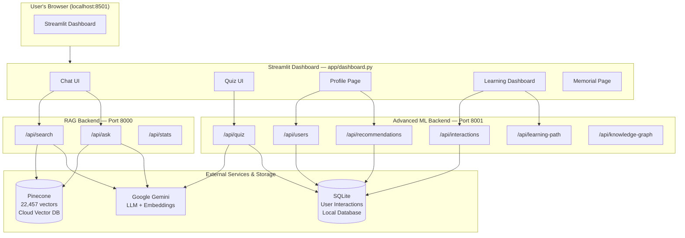

### What "Three Servers" Means

When you run PeatLearn, **three separate programs** start on your computer:

1. **Streamlit Dashboard** (port 8501) — the website you see in your browser
2. **RAG Backend** (port 8000) — handles search and question-answering
3. **ML Backend** (port 8001) — handles quizzes, recommendations, and personalisation

They talk to each other over **HTTP** (the same protocol your browser uses to load websites). This is called a **microservices architecture** — instead of one giant program, you have small specialised programs that communicate.

> **Why separate them?** If the quiz system crashes, the chatbot still works. You can also update one without restarting the others.

### How to Start Everything

```bash
# Option 1: Start all three at once
python scripts/run_servers.py

# Option 2: Start them individually (in separate terminals)
streamlit run app/dashboard.py           # Terminal 1
uvicorn app.api:app --port 8000 --reload # Terminal 2  
uvicorn app.advanced_api:app --port 8001 --reload # Terminal 3
```

---

## 3. The Three Servers

### 3.1 The RAG Backend (Port 8000)

**File:** `app/api.py`

This server has three jobs:

| Endpoint | What It Does | Example |
|---|---|---|
| `GET /api/search?q=thyroid` | Finds similar passages in the corpus | Returns top 10 passages about thyroid |
| `GET /api/ask?question=What does Ray Peat say about sugar?` | Finds passages AND generates a written answer | Returns a paragraph + sources |
| `GET /api/stats` | Returns corpus statistics | "552 documents, 22,557 vectors" |

**Technology:** Built with **FastAPI**, a Python web framework that's fast and easy to use.

### 3.2 The ML Backend (Port 8001)

**File:** `app/advanced_api.py`

This server handles everything related to personalisation:

| Endpoint | What It Does |
|---|---|
| `POST /api/quiz` | Generates adaptive quiz questions |
| `POST /api/users` | Creates or updates user profiles |
| `POST /api/interactions` | Records what the user did (clicked, answered, etc.) |
| `GET /api/recommendations/{user_id}` | Suggests what to study next |
| `GET /api/learning-path/{user_id}` | Plans a learning sequence |
| `GET /api/knowledge-graph` | Returns the concept relationship map |

### 3.3 The Streamlit Dashboard (Port 8501)

**File:** `app/dashboard.py`

This is the **frontend** — the part users see and interact with. Streamlit is a Python library that turns Python scripts into web apps without needing HTML/CSS/JavaScript expertise.

The dashboard has these pages:
- **Chat** — ask questions, get AI answers
- **Quiz** — take adaptive quizzes
- **Profile** — see your learning stats
- **Dashboard** — visualise your progress with charts
- **Memorial** — tribute to Dr. Ray Peat

---

## 4. The Data Pipeline

### What's a "Data Pipeline"?

A data pipeline is a series of steps that transforms **raw data** into **usable data**. Think of it like a factory assembly line: raw materials go in one end, and a finished product comes out the other.

### The Full Pipeline

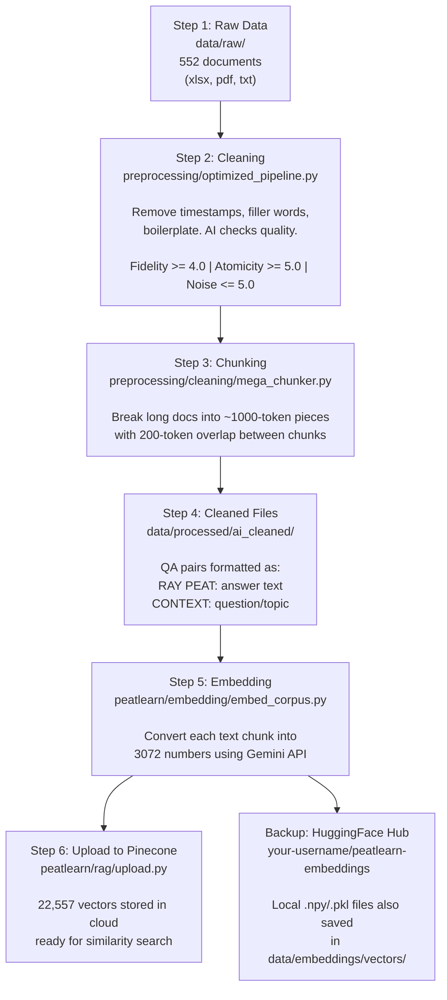

### Why Chunk With Overlap?

LLMs have input limits, and smaller chunks mean more precise search results. But if you cut a document right in the middle of an idea, you lose context. **Overlap** (200 tokens shared between consecutive chunks) ensures ideas at boundaries are preserved in at least one chunk.

```mermaid
flowchart LR
    subgraph Original["Original Document (5000 tokens)"]
        direction TB
        P1["Paragraph about thyroid"]
        P2["Paragraph about thyroid"]
        P3["Paragraph about metabolism"]
        P4["Paragraph about metabolism"]
        P5["Paragraph about sugar"]
    end

    subgraph Chunks["After Chunking"]
        direction TB
        C1["Chunk 1 (1000 tokens)\nthyroid content"]
        OL1["200 tokens overlap"]
        C2["Chunk 2 (1000 tokens)\nthyroid + metabolism"]
        OL2["200 tokens overlap"]
        C3["Chunk 3 (1000 tokens)\nmetabolism + sugar"]
    end

    Original --> Chunks
```

### The Checkpoint System

**File:** `preprocessing/checkpoint_system.py`

Processing 552 documents takes time. What if your computer crashes halfway through? The checkpoint system saves progress so you can **resume where you left off** instead of starting over. This same pattern is used in the re-embedding script (`scripts/reembed_full_corpus.py`).

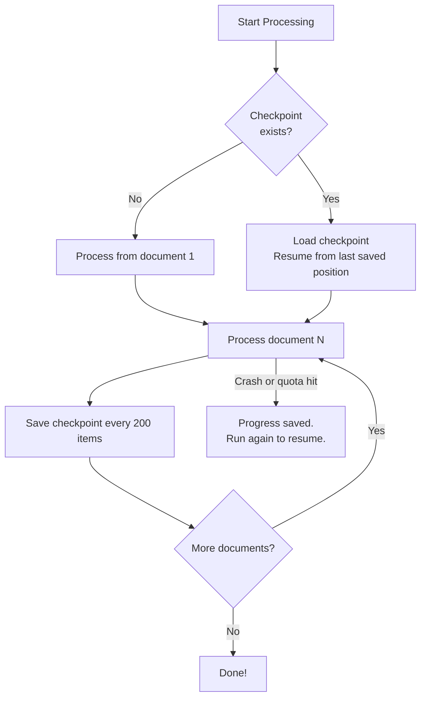

---

## 5. The RAG System

### What Is RAG?

**RAG** stands for **Retrieval-Augmented Generation**. It's a two-step process:

1. **Retrieval** — find relevant passages from a database
2. **Generation** — use an LLM to write an answer based on those passages

Without RAG, an LLM can only answer from its training data (which might be outdated or wrong). With RAG, it answers from **your specific documents** — much more accurate.

### RAG Flow

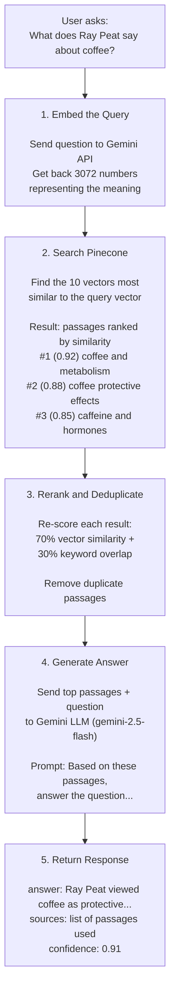

### How Embeddings Work (The Key Insight)

An **embedding** is a list of numbers that represents the *meaning* of a piece of text. The crucial property is:

> **Texts with similar meanings produce similar numbers.**

| Text | Embedding (simplified) | Notes |
|---|---|---|
| "thyroid hormone" | [0.82, -0.15, 0.44, 0.67, ...] | |
| "T3 and T4" | [0.80, -0.13, 0.46, 0.65, ...] | Very similar to above! |
| "chocolate cake" | [-0.31, 0.72, -0.08, 0.11, ...] | Very different! |

PeatLearn uses Google's `gemini-embedding-001` model, which produces **3072 numbers** per text. These numbers live in a "3072-dimensional space" — you can't visualise it, but mathematically you can measure distance between any two points.

**Cosine similarity** measures how "aligned" two vectors are:
- **1.0** = identical meaning
- **0.0** = completely unrelated
- **-1.0** = opposite meaning (rare in practice)

### The Vector Database: Pinecone

**Pinecone** is a cloud service optimised for storing and searching vectors. It's like a regular database, but instead of `SELECT * WHERE name = 'coffee'`, you say "find me the 10 vectors closest to this query vector."

| ID | Vector (3072 dims) | Metadata |
|---|---|---|
| vec_0 | [0.23, -0.11, ...] | source: "transcript_001.txt" |
| vec_1 | [0.45, 0.32, ...] | source: "paper_042.txt" |
| vec_2 | [-0.08, 0.67, ...] | source: "newsletter_015.txt" |
| ... | ... | ... |
| vec_22456 | [0.11, -0.44, ...] | source: "transcript_188.txt" |

**Total: 22,457 vectors** in the `ray-peat-corpus` index.

> Note: The corpus parses **22,557 QA pairs** from source documents, but 100 were skipped during embedding (API errors, retries exhausted). The Pinecone index holds the 22,457 successfully embedded vectors.

### Key Files

| File | Class | Purpose |
|---|---|---|
| `peatlearn/rag/vector_search.py` | `PineconeVectorSearch` | Handles embedding queries and searching Pinecone |
| `peatlearn/rag/rag_system.py` | `PineconeRAG` | Orchestrates retrieval, reranking, and generation |
| `peatlearn/rag/upload.py` | (functions) | Uploads vectors to Pinecone in batches |
| `peatlearn/rag/utils.py` | (utilities) | Helper functions for the RAG system |

### The Offline Fallback

What if the Gemini API is down? `PineconeVectorSearch` has a clever fallback using SHA-256 hashing:

```python
# Normal: Use Gemini to create meaningful embeddings
embedding = await gemini_api.embed("thyroid function")

# Fallback: Use SHA-256 hash to create deterministic (but not meaningful) embeddings
# This lets tests run without API keys
hash_bytes = hashlib.sha256("thyroid function".encode()).digest()
embedding = [byte / 255.0 for byte in hash_bytes]  # normalize to [0, 1]
```

The hash fallback won't find semantically relevant results, but it allows the system to **start up and run tests** without needing API keys.

---

## 6. The Adaptive Learning System

### What Is "Adaptive Learning"?

Traditional learning gives everyone the same content in the same order. **Adaptive learning** adjusts based on how well you're doing:

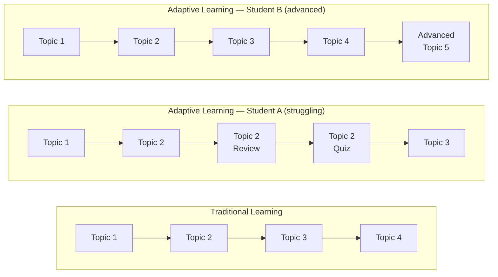

### Components of the Adaptive System

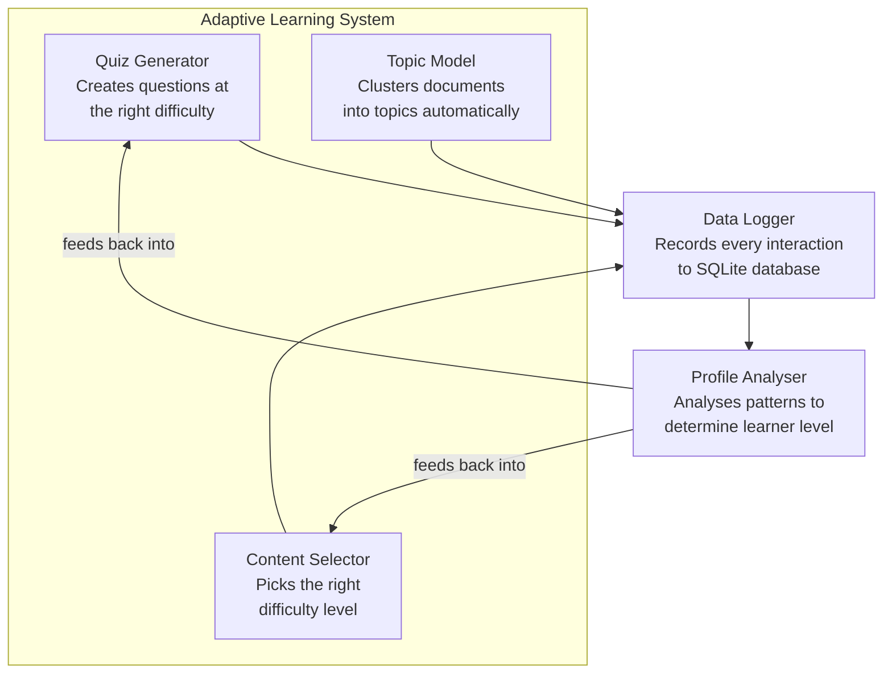

### 6.1 Quiz Generator

**File:** `peatlearn/adaptive/quiz_generator.py`

The quiz generator creates **multiple-choice questions** tailored to each learner:

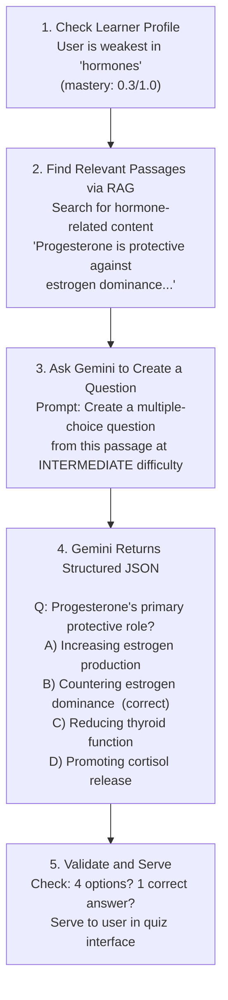

**LLM Settings for Quiz Generation:**
- Model: `gemini-2.5-flash-lite` (fast, cheap — good enough for question generation)
- Temperature: 0.6 (some creativity, but not too random)
- Max tokens: 800
- Output format: JSON (structured, parseable)

### 6.2 Topic Model

**File:** `peatlearn/adaptive/topic_model.py`

The topic model automatically discovers what topics exist in the corpus. No human has to manually label documents.

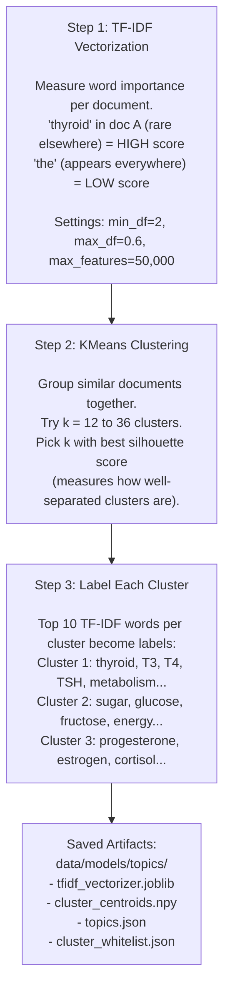

### 6.3 Content Selector

**File:** `peatlearn/adaptive/content_selector.py`

The content selector adjusts **how** the AI talks to you based on your level:

| Level | Mastery Score | Prompt Style | Example Output |
|---|---|---|---|
| **Struggling** | < 0.3 | Simple language, everyday analogies, encouraging tone | "Think of your thyroid like a thermostat for your body. When it's working well, you have energy, feel warm, and think clearly." |
| **Learning** | 0.3 - 0.7 | Balanced detail, technical terms explained, progressive complexity | "The thyroid gland produces T4 (thyroxine) and T3 (triiodothyronine). T3 is the active form — it directly increases cellular metabolism." |
| **Advanced** | > 0.7 | Precise scientific language, mechanisms and research, assumes familiarity | "Peat emphasised T4-to-T3 conversion by selenium-dependent deiodinase enzymes. PUFAs inhibit this conversion, creating cellular hypothyroidism despite normal serum TSH." |

### 6.4 Data Logger

**File:** `peatlearn/adaptive/data_logger.py`

Every interaction is recorded in an SQLite database at `data/user_interactions/interactions.db`:

| id | user_id | user_query | topic | feedback | type |
|---|---|---|---|---|---|
| 1 | alice | "what is thyroid?" | thyroid | 1 (thumbs up) | question |
| 2 | alice | (quiz attempt) | thyroid | NULL | quiz |
| 3 | bob | "sugar benefits?" | nutrition | -1 (thumbs down) | question |

This data feeds into the recommendation and personalisation systems.

---

## 7. The Personalization Engine

### Architecture

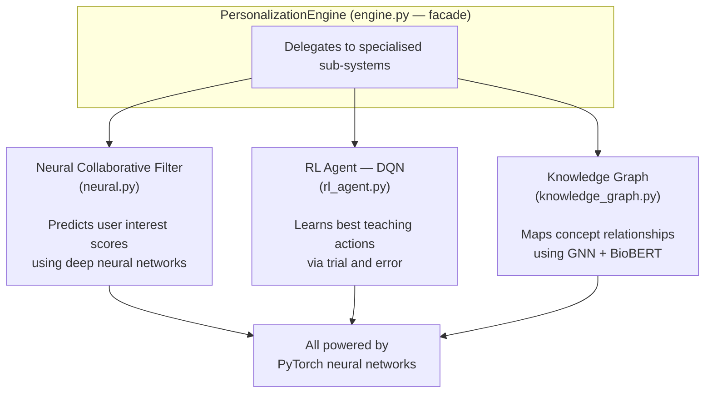

### Neural Collaborative Filtering

**File:** `peatlearn/personalization/neural.py`

**What is Collaborative Filtering?**

It's the idea behind "users who liked X also liked Y." If Alice and Bob have similar learning patterns, content that helped Alice might help Bob too.

**The Neural Network Architecture:**

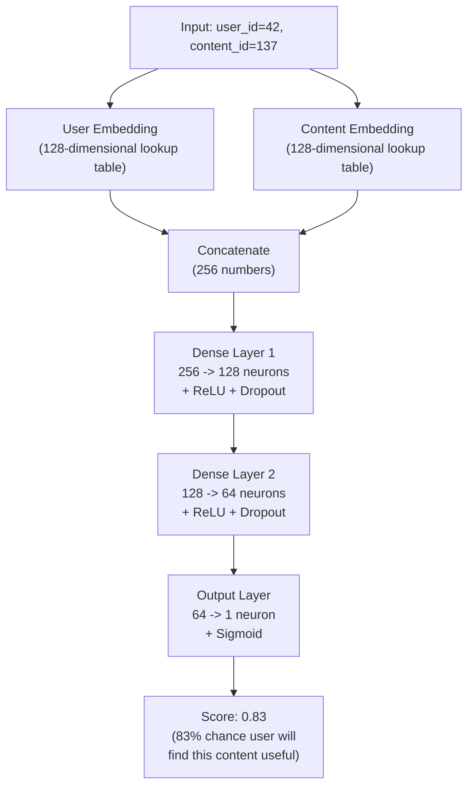

**Key terms explained:**
- **Embedding**: A learned lookup table that converts an ID (like "user 42") into a meaningful list of numbers
- **ReLU**: A simple function that replaces negative numbers with zero — helps the network learn non-linear patterns
- **Dropout**: Randomly "turns off" some neurons during training to prevent overfitting (memorising instead of learning)
- **Sigmoid**: Squishes the output to be between 0 and 1 (a probability)

---

## 8. The Recommendation System

### Matrix Factorization

**File:** `peatlearn/recommendation/mf_trainer.py`

This is a simpler (but very effective) recommendation approach.

**The Core Idea:**

Imagine a big table of users x content, where each cell is "how much did this user like this content?" Most cells are empty (users haven't seen most content).

| | Content 1 | Content 2 | Content 3 | Content 4 |
|---|---|---|---|---|
| **User Alice** | 0.8 | ? | 0.3 | ? |
| **User Bob** | ? | 0.9 | ? | 0.7 |
| **User Carol** | 0.6 | ? | ? | 0.5 |

Matrix factorization **fills in the blanks** by finding hidden patterns. It decomposes the big matrix into two smaller ones:

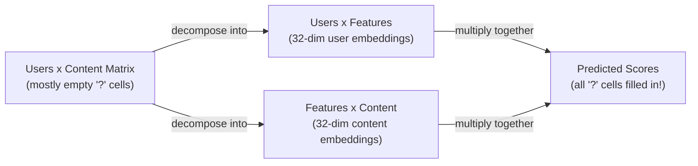

**Training Algorithm (SGD — Stochastic Gradient Descent):**

```python
# Simplified version of what mf_trainer.py does:

for epoch in range(15):
    for user, item, actual_score in interactions:
        # Predict: dot product of user and item embeddings
        predicted = dot_product(user_embedding[user], item_embedding[item])
        
        # Calculate error
        error = actual_score - predicted
        
        # Update embeddings to reduce error
        user_embedding[user]  += learning_rate * error * item_embedding[item]
        item_embedding[item]  += learning_rate * error * user_embedding[user]
    
    learning_rate *= 0.95  # decay: slow down as we converge
```

**Settings:**
- Latent dimensions: 32 (each user and item is represented by 32 numbers)
- Epochs: 15 (passes over the data)
- Learning rate: 0.01, decaying by 0.95x per epoch
- Saved to: `data/models/recs/mf_model.npz`

---

## 9. The Knowledge Graph

### What Is a Knowledge Graph?

A knowledge graph represents **concepts as nodes** and **relationships as edges**:

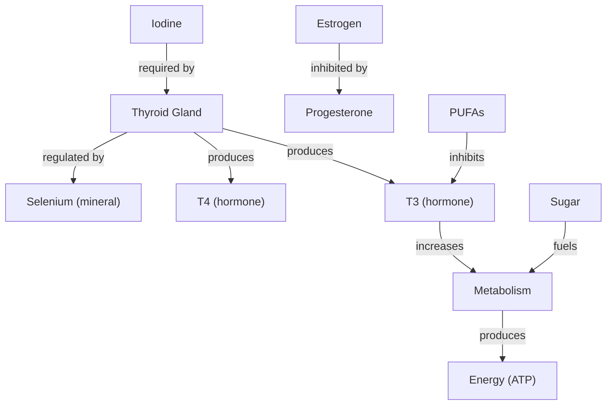

### How PeatLearn Builds Its Knowledge Graph

**File:** `peatlearn/personalization/knowledge_graph.py`

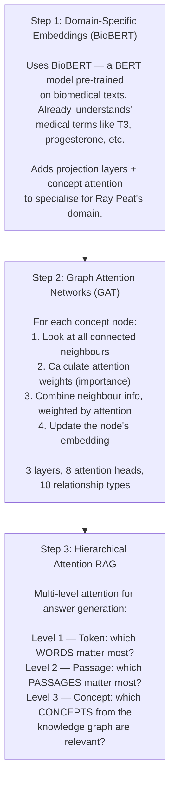

**Why BioBERT instead of regular BERT?**

| Input | Regular BERT | BioBERT |
|---|---|---|
| "T3" | Generic embedding (might think it's a car model) | Biomedical embedding (knows it's triiodothyronine) |
| "PUFA" | Meaningless abbreviation | Polyunsaturated fatty acid |
| "cortisol" | Basic word embedding | Stress hormone, linked to adrenal function |

**How GAT Learns (Example for "Thyroid" node):**

The Thyroid node has neighbours: T3, T4, TSH, Iodine, Selenium. GAT calculates attention weights to determine how important each neighbour is:

| Neighbour | Attention Weight | Meaning |
|---|---|---|
| T3 | 0.35 | Most important connection |
| T4 | 0.25 | Important hormone output |
| TSH | 0.20 | Regulatory signal |
| Iodine | 0.10 | Required nutrient |
| Selenium | 0.10 | Required for T4-to-T3 conversion |

The new thyroid embedding = weighted combination of all neighbours. This repeats for 3 layers, so information propagates across the entire graph (3-hop reach).

---

## 10. The Reinforcement Learning Agent

### What Is Reinforcement Learning?

RL is about learning through **trial and error**, like training a dog: good actions get rewards, bad actions get penalties.

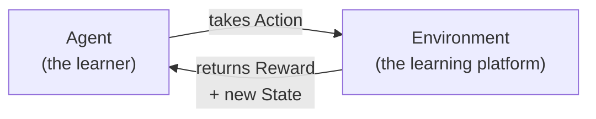

### How PeatLearn Uses RL

**File:** `peatlearn/personalization/rl_agent.py`

The RL agent decides **what to show the learner next**:

| Category | Details |
|---|---|
| **State** (what the agent observes) | Topic mastery scores, recent quiz performance (last 5), time spent on topic, engagement level, fatigue indicator, current difficulty |
| **Actions** (what the agent can do) | 1. RECOMMEND_CONTENT, 2. ADJUST_DIFFICULTY, 3. SUGGEST_QUIZ, 4. TAKE_BREAK, 5. REVIEW_TOPIC |
| **Positive Rewards** | User completes quiz with high score, user engagement increases |
| **Negative Rewards** | User leaves session early, user scores poorly after recommendation |

### Deep Q-Network (DQN)

The agent uses a **DQN** — a neural network that predicts the "value" of each action given the current state:

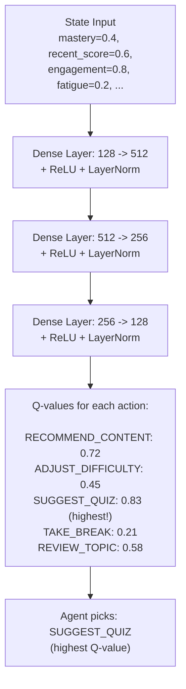

### Exploration vs Exploitation (Epsilon-Greedy)

The RL agent needs to balance trying new things (exploration) with doing what works (exploitation):

| Training Phase | Epsilon | Behaviour |
|---|---|---|
| Early (episode 1) | 1.0 | 100% random actions — "I know nothing, let me try everything" |
| Middle (episode 100) | 0.5 | 50/50 split — learning but still experimenting |
| Late (episode 500) | 0.1 | 90% best action, 10% random — "Mostly do what works, occasionally try something new" |

### Experience Replay

The agent stores past experiences `(state, action, reward, next_state)` in a buffer (max 10,000 entries). During training, it samples **random batches** from this buffer rather than learning only from the most recent experience. This prevents the agent from being biased by what just happened and helps it learn more stable patterns.

---

## 11. The Frontend

### Streamlit Dashboard Overview

**File:** `app/dashboard.py`

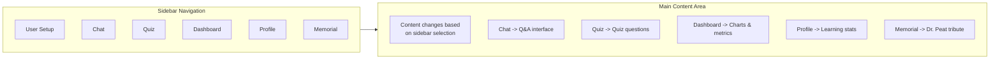

### Session State

Streamlit re-runs the entire script on every interaction. To maintain state between re-runs, PeatLearn uses `st.session_state`:

```python
st.session_state = {
    'user_id': "alice_42",           # who is logged in
    'learning_style': "visual",      # visual/auditory/reading/kinesthetic
    'topic_mastery': {               # mastery per topic (0-1)
        'thyroid': 0.65,
        'nutrition': 0.42,
        'hormones': 0.78
    },
    'chat_history': [                # conversation memory
        {"role": "user", "content": "What about sugar?"},
        {"role": "assistant", "content": "Ray Peat viewed sugar as..."}
    ],
    'quiz_state': {                  # current quiz progress
        'questions': [...],
        'current_index': 2,
        'score': 1
    }
}
```

### Dashboard Visualisations

The learning dashboard uses **Plotly** (a charting library) to show:

1. **Topic Mastery Heatmap** — bar chart showing your knowledge level per topic
2. **Learning Velocity** — how fast you're learning (interactions per week)
3. **Quiz Performance Over Time** — line chart of quiz scores
4. **Interaction Timeline** — scatter plot of what you studied and when

All charts use a dark theme (`plotly_dark`) for visual consistency.

### Dev Mode Auto-Refresh

When developing, you want the dashboard to update when you change code. PeatLearn uses **watchdog** (a file monitoring library):

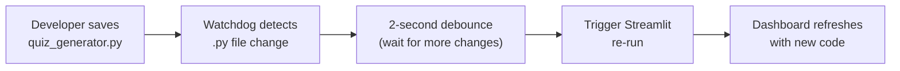

Enabled with: `PEATLEARN_DEV_MODE=true` or `--dev` flag.

---

## 12. Configuration and Secrets

### The Settings System

**File:** `config/settings.py`

PeatLearn uses **Pydantic BaseSettings**, which automatically reads from environment variables and `.env` files:

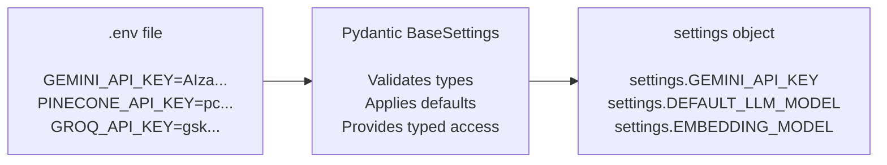

**Usage in code:**
```python
from config.settings import settings

api_key = settings.GEMINI_API_KEY
model = settings.DEFAULT_LLM_MODEL  # "gemini-2.5-flash"
```

### Environment Variables

| Variable | Required | Purpose |
|---|---|---|
| `GEMINI_API_KEY` | Yes | Google AI for LLM + embeddings |
| `PINECONE_API_KEY` | Yes | Vector database |
| `GROQ_API_KEY` | No | Fallback LLM provider |
| `HF_TOKEN` | No | HuggingFace embedding sync |
| `PEATLEARN_DEV_MODE` | No | Enable dev features (auto-refresh) |

**Security rule:** API keys NEVER appear in code. They live only in `.env` (which is in `.gitignore`).

---

## 13. Testing

### Test Structure

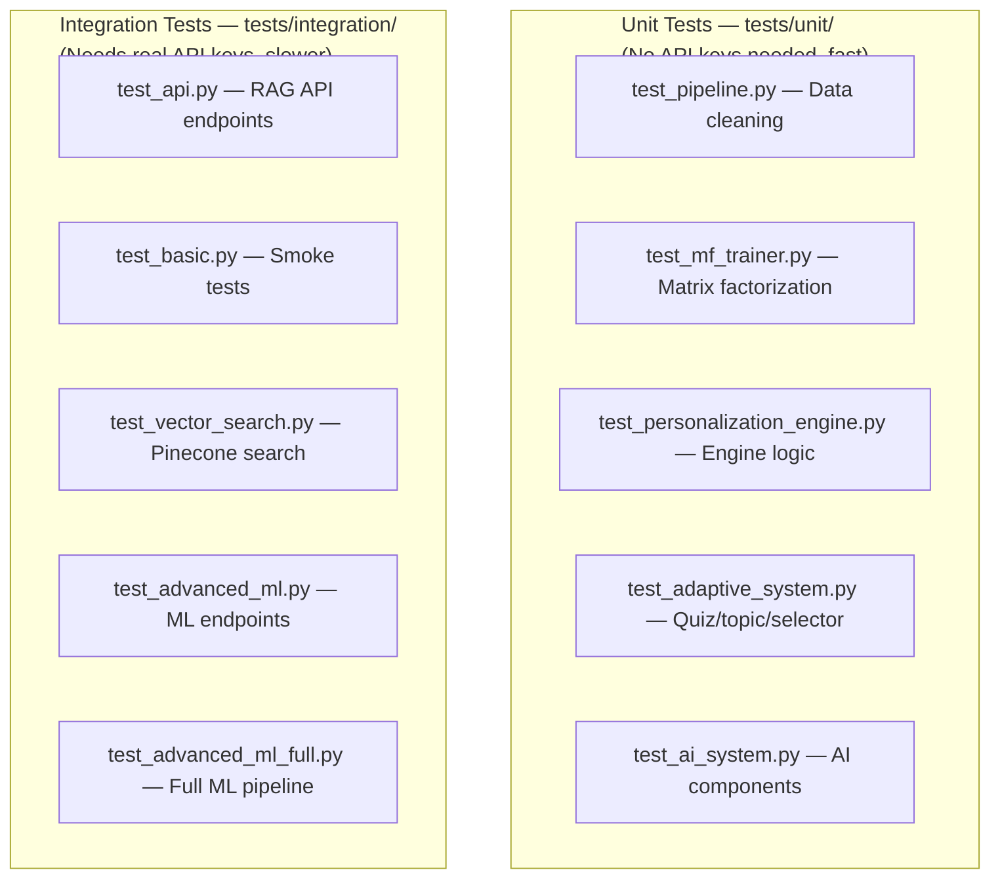

### Running Tests

```bash
# Run all tests
pytest tests/

# Run only unit tests (fast, no API keys needed)
pytest tests/unit/

# Run a specific test file with verbose output
pytest tests/unit/test_mf_trainer.py -v
```

### Testing Philosophy

- **Unit tests** use **mocks** (fake versions of APIs) so they run fast and don't cost money
- **Integration tests** hit real APIs to verify the full system works
- Tests use **temporary directories** for file operations (cleaned up after)
- Tests use **in-memory SQLite** databases (no disk writes)

---

## 14. Key Algorithms Explained

### 14.1 Cosine Similarity

Measures how similar two vectors are. Used everywhere in the RAG system.

**Formula:** `cosine(A, B) = (A dot B) / (|A| x |B|)`

**Worked example:**

| | Calculation | Result |
|---|---|---|
| Vector A | [1, 2, 3] | |
| Vector B | [2, 4, 6] | |
| A dot B | (1x2 + 2x4 + 3x6) | 28 |
| \|A\| | sqrt(1 + 4 + 9) | 3.74 |
| \|B\| | sqrt(4 + 16 + 36) | 7.48 |
| **Cosine(A,B)** | 28 / (3.74 x 7.48) | **1.0** (identical direction!) |

Compare with Vector C = [3, -1, 0]: Cosine(A,C) = 0.085 (very different!).

### 14.2 Reranking Formula

After initial vector search, results are re-scored combining two signals:

**`final_score = 0.7 x vector_similarity + 0.3 x keyword_overlap`**

Where `keyword_overlap = |shared_words| / max(|query_words|, |passage_words|)` (after removing common words like "the", "is", "a").

**Example:**
- Query: "thyroid hormone production"
- Passage: "The thyroid gland produces T3 and T4 hormones"
- Vector similarity: 0.85
- Shared words: {"thyroid", "hormone"} = 2 words
- Query words: {"thyroid", "hormone", "production"} = 3 words
- Keyword overlap: 2/3 = 0.67
- **Final score: 0.7 x 0.85 + 0.3 x 0.67 = 0.595 + 0.201 = 0.796**

### 14.3 MMR (Maximal Marginal Relevance)

Prevents returning 5 passages that all say the same thing. Balances **relevance** with **diversity**:

**`MMR_score = lambda x relevance_to_query - (1-lambda) x similarity_to_already_selected`**

Where lambda = 0.7 (favour relevance over diversity).

```mermaid
flowchart TD
    S1["Step 1: Pick most relevant passage\nP1 (relevance=0.92)\nSelected: P1"] --> S2["Step 2: Score remaining candidates\n\nP2: relevant (0.88) but similar to P1 (0.95)\nscore = 0.7x0.88 - 0.3x0.95 = 0.331\n\nP3: less relevant (0.80) but different (0.30)\nscore = 0.7x0.80 - 0.3x0.30 = 0.470"]
    S2 --> S3["P3 wins! (0.470 > 0.331)\nMore diverse = better\nSelected: P1, P3"]
    S3 --> S4["Repeat until enough\npassages selected"]
```

### 14.4 TF-IDF

**Term Frequency x Inverse Document Frequency** — measures word importance:

| Component | Formula | What It Measures |
|---|---|---|
| **TF** (Term Frequency) | occurrences / total_words_in_doc | How often the word appears in THIS document |
| **IDF** (Inverse Document Frequency) | log(total_docs / docs_containing_word) | How rare the word is across ALL documents |
| **TF-IDF** | TF x IDF | Overall importance |

**Example:**
- "thyroid" in doc A: appears 10 times in 100 words, in 50 of 552 docs
  - TF = 10/100 = 0.1, IDF = log(552/50) = 2.4, **TF-IDF = 0.24** (important!)
- "the" in doc A: appears 5 times in 100 words, in 550 of 552 docs
  - TF = 5/100 = 0.05, IDF = log(552/550) = 0.004, **TF-IDF = 0.0002** (not important)

### 14.5 Silhouette Score

Measures how well data points are grouped into clusters:

| Score | Meaning |
|---|---|
| **1.0** | Perfectly clustered |
| **0.0** | On the boundary between clusters |
| **-1.0** | Probably in the wrong cluster |

**How it works:** For each data point, calculate (a) average distance to points in same cluster, and (b) average distance to points in nearest other cluster. Score = (b - a) / max(a, b).

The topic model tries k=12 to k=36 clusters and picks the k with the highest average silhouette score.

### 14.6 Epsilon-Greedy Exploration

How the RL agent balances exploration (trying new things) with exploitation (doing what works):

```python
if random() < epsilon:
    action = random_action()      # EXPLORE: try something new
else:
    action = best_known_action()  # EXPLOIT: do what works best
```

Epsilon starts high (1.0 = all exploration) and decays toward low (0.1 = mostly exploitation).

---

## 15. File-by-File Reference

### Entry Points

| File | Lines | What It Does |
|---|---|---|
| `app/dashboard.py` | ~2000 | Main Streamlit UI — chat, quiz, profile, charts |
| `app/api.py` | ~200 | RAG FastAPI server — search and Q&A endpoints |
| `app/advanced_api.py` | ~400 | ML FastAPI server — personalisation endpoints |
| `peatlearn_master.py` | ~100 | Backward-compatible launcher → runs `streamlit run app/dashboard.py` only |
| `scripts/run_servers.py` | ~80 | Multi-service process manager |

### RAG Package (`peatlearn/rag/`)

| File | Key Class | What It Does |
|---|---|---|
| `vector_search.py` | `PineconeVectorSearch` | Embeds queries, searches Pinecone, returns results |
| `rag_system.py` | `PineconeRAG` | Orchestrates: search, reranking, LLM answer |
| `upload.py` | (functions) | Uploads vectors to Pinecone in batches |
| `utils.py` | (utilities) | ID sanitization, helper functions |

### Adaptive Package (`peatlearn/adaptive/`)

| File | Key Class | What It Does |
|---|---|---|
| `quiz_generator.py` | `QuizGenerator` | Creates MCQ questions using Gemini LLM |
| `topic_model.py` | `CorpusTopicModel` | Auto-discovers topics via TF-IDF + KMeans |
| `content_selector.py` | `ContentSelector` | Adjusts content difficulty for learner level |
| `data_logger.py` | `DataLogger` | Records all interactions to SQLite |
| `profile_analyzer.py` | `TopicExtractor` | Extracts topics from text using keyword matching |
| `ai_profile_analyzer.py` | `AIEnhancedProfiler` | Uses Gemini to assess learner mastery |
| `dashboard.py` | `Dashboard` | Renders Plotly charts for learning analytics |
| `enhanced_memorial.py` | (functions) | Renders the Dr. Ray Peat memorial page |

### Personalization Package (`peatlearn/personalization/`)

| File | Key Class | What It Does |
|---|---|---|
| `engine.py` | `PersonalizationEngine` | Facade that delegates to sub-systems |
| `neural.py` | `NeuralCollaborativeFilter` | Deep neural network for user-content scoring |
| `rl_agent.py` | `AdaptiveLearningAgent` | DQN that learns optimal teaching actions |
| `knowledge_graph.py` | `AdvancedKnowledgeGraph` | GNN + BioBERT concept reasoning |
| `quiz_logger.py` | (functions) | Logs quiz outcomes to SQLite |
| `utils.py` | (functions) | Difficulty estimation, MMR, MCQ generation |

### Embedding Package (`peatlearn/embedding/`)

| File | What It Does |
|---|---|
| `embed_corpus.py` | Generates embeddings for the entire corpus using Gemini |
| `cache.py` | SHA-256 based caching to avoid re-embedding unchanged docs |
| `hf_upload.py` | Pushes embeddings to HuggingFace Hub |
| `hf_download.py` | Downloads embeddings from HuggingFace Hub |

### Recommendation Package (`peatlearn/recommendation/`)

| File | What It Does |
|---|---|
| `mf_trainer.py` | Matrix factorization with SGD — learns user and content embeddings |

### Preprocessing (`preprocessing/`)

| File | What It Does |
|---|---|
| `optimized_pipeline.py` | Main data processing pipeline (clean, chunk, validate) |
| `parallel_processor.py` | Runs pipeline stages in parallel across CPU cores |
| `checkpoint_system.py` | Saves/resumes processing progress |
| `preprocessing/cleaning/mega_chunker.py` | Splits documents into ~1000-token chunks with overlap |

### Configuration

| File | What It Does |
|---|---|
| `config/settings.py` | Pydantic BaseSettings — reads `.env`, provides typed config |
| `.env` | API keys and environment variables (not in git) |

---

## 16. Glossary

| Term | Definition |
|---|---|
| **API** | Application Programming Interface — a way for programs to communicate with each other |
| **Async** | Asynchronous — the program can do other things while waiting for a slow operation (like an API call) |
| **Batch** | Processing multiple items at once instead of one at a time |
| **BioBERT** | A version of BERT pre-trained on biomedical texts |
| **BERT** | Bidirectional Encoder Representations from Transformers — a foundational language model |
| **Chunking** | Breaking long text into smaller pieces for processing |
| **Cosine Similarity** | A measure of how similar two vectors are (1.0 = identical, 0.0 = unrelated) |
| **CORS** | Cross-Origin Resource Sharing — security rules for web requests between different domains |
| **DQN** | Deep Q-Network — a neural network that learns action values for reinforcement learning |
| **Embedding** | A list of numbers representing the meaning of text (similar meanings produce similar numbers) |
| **Endpoint** | A specific URL that a server responds to (like `/api/search`) |
| **Epoch** | One complete pass through all training data |
| **Epsilon-Greedy** | An RL strategy that mostly picks the best action but sometimes tries random ones |
| **Experience Replay** | Storing and re-using past experiences to train an RL agent more efficiently |
| **Facade** | A design pattern where one class delegates work to multiple specialised classes |
| **FastAPI** | A Python web framework for building APIs quickly |
| **GAT** | Graph Attention Network — a neural network that learns on graph-structured data |
| **GNN** | Graph Neural Network — neural networks designed for graph data |
| **Implicit Feedback** | User behaviour (clicks, time spent) rather than explicit ratings |
| **KMeans** | A clustering algorithm that groups data into k clusters |
| **Knowledge Graph** | A network of concepts connected by relationships |
| **LLM** | Large Language Model — an AI that generates text (like Gemini, GPT, Claude) |
| **Matrix Factorization** | Decomposing a large matrix into smaller ones to find hidden patterns |
| **Microservices** | Architecture where an application is split into small, independent services |
| **MMR** | Maximal Marginal Relevance — an algorithm that balances relevance with diversity |
| **Mock** | A fake version of a component used in testing |
| **Pinecone** | A cloud vector database optimised for similarity search |
| **Pydantic** | A Python library for data validation using type annotations |
| **RAG** | Retrieval-Augmented Generation — find relevant docs, then generate an answer |
| **ReLU** | Rectified Linear Unit — f(x) = max(0, x), used in neural networks |
| **Reinforcement Learning** | Learning by trial and error with rewards and penalties |
| **SGD** | Stochastic Gradient Descent — an optimisation algorithm that updates weights step by step |
| **SHA-256** | A hash function that converts any input into a fixed-length string of characters |
| **Sigmoid** | A function that squishes values to between 0 and 1 |
| **Silhouette Score** | Measures how well data points are grouped into clusters (-1 to 1, higher = better) |
| **SQLite** | A lightweight database stored as a single file |
| **Streamlit** | A Python library that turns scripts into web applications |
| **TF-IDF** | Term Frequency x Inverse Document Frequency — measures word importance |
| **Uvicorn** | An ASGI server that runs FastAPI applications |
| **Vector** | A list of numbers representing a point in multi-dimensional space |
| **Vector Database** | A database optimised for storing and searching vectors by similarity |
| **Watchdog** | A Python library that monitors file system changes |

---

## Corpus Statistics

| Metric | Value |
|---|---|
| Source documents | 552 |
| Audio transcripts | 188 |
| Research papers | 96 |
| Health topics | 98 |
| Newsletters | 59 |
| Other documents | ~111 |
| Total QA pairs parsed | 22,557 |
| Vectors in Pinecone | 22,457 |
| Embedding dimensions | 3072 (native Gemini) |
| Embedding model | `gemini-embedding-001` |
| Vector database | Pinecone (`ray-peat-corpus`) |
| LLM for answers | `gemini-2.5-flash` |
| LLM for quizzes | `gemini-2.5-flash-lite` |
| Topic clusters | 12-36 (auto-selected) |
| MF dimensions | 32 |

---

## 17. Future Plans — LLM Fine-Tuning

### The Vision

Right now, PeatLearn uses Google Gemini as a general-purpose LLM. It knows about Ray Peat's ideas only because those ideas exist in its training data and because we feed it relevant passages via RAG. A **fine-tuned model** would have Ray Peat's philosophy baked into its weights — it would answer in his style, use his terminology naturally, and reason from his framework without needing to be told.

### What Is Fine-Tuning?

Training a model from scratch costs millions of dollars. Fine-tuning is the cheaper alternative: you take an already-trained model and **continue training it on your specific data**, so it learns domain-specific patterns.

```
General LLM                   Fine-tuned LLM
(knows everything broadly)  → (knows Ray Peat's domain deeply)

Input: "What causes fatigue?"
General: "Fatigue can be caused by many factors..."
Fine-tuned: "Fatigue is often a sign of cellular hypothyroidism —
             the cell's inability to oxidise glucose efficiently..."
```

### What Data We Have

PeatLearn already has the perfect fine-tuning dataset: **22,557 QA pairs** in the format:

```
CONTEXT: [topic or question]
RAY PEAT: [Ray Peat's actual words on this topic]
```

This is already structured as instruction-following data — exactly what modern fine-tuning needs.

### Fine-Tuning Approaches (Best to Worst Fit)

#### Option 1: LoRA / QLoRA (Recommended)
**Low-Rank Adaptation** — the most practical approach for this project.

Instead of updating all model weights (expensive), LoRA adds small trainable matrices to specific layers:

```mermaid
flowchart LR
    Input --> Frozen["Frozen Base Model\n(e.g. Llama 3, Mistral 7B)\nWeights unchanged"]
    Frozen --> LoRA["LoRA Adapter\n(small trainable matrices\n~1% of parameters)"]
    LoRA --> Output["Fine-tuned output\nRay Peat style"]
```

- **QLoRA** = LoRA + quantization (4-bit weights) → runs on a single consumer GPU
- Library: `peft` + `transformers` (HuggingFace)
- Training time: ~4-8 hours on a single GPU with 22k examples
- Cost: Free on Google Colab Pro, or ~$10-30 on a cloud GPU

#### Option 2: Full Fine-Tuning (Expensive)
Update all model weights. Requires multiple high-end GPUs. Not practical for this project without significant compute budget.

#### Option 3: Gemini Fine-Tuning API (Easiest)
Google offers fine-tuning for Gemini models through their API. Simpler to set up, but:
- Costs money per training token
- Less control over the process
- The fine-tuned model is locked to Google's platform

### What Would Change

| Capability | Today (RAG only) | With Fine-Tuned LLM |
|---|---|---|
| Domain vocabulary | Needs retrieved context to use correctly | Naturally uses T3, PUFA, bioenergetics, etc. |
| Answer style | General assistant style | Ray Peat's reasoning style |
| Rare topics | Fails if not in Pinecone | May answer from baked-in knowledge |
| Hallucination risk | Low (RAG grounds it) | Higher (fine-tuned models can confabulate) |
| Speed | API call to Gemini | Can run locally if self-hosted |

### Recommended Stack

```
Base model:    Llama 3.1 8B  or  Mistral 7B
Method:        QLoRA (4-bit quantization)
Library:       HuggingFace PEFT + TRL
Dataset:       data/processed/ai_cleaned/ → 22,557 QA pairs
Hardware:      Single GPU (16GB+ VRAM) or Google Colab Pro
Deployment:    Ollama (local) or HuggingFace Inference Endpoints
```

### Integration with PeatLearn

After fine-tuning, the model would replace (or supplement) Gemini in `peatlearn/rag/rag_system.py`. The RAG pipeline stays identical — only the generation step changes:

```python
# Current
response = gemini_client.generate_content(model="gemini-2.5-flash", contents=prompt)

# With fine-tuned model (via Ollama local server)
response = requests.post("http://localhost:11434/api/generate",
                         json={"model": "peatlearn-llama3", "prompt": prompt})
```

This means the entire retrieval system (Pinecone, reranking, dedup) stays untouched — only the final answer generation improves.

### Important Caution

Fine-tuning on a single person's writing carries a risk: the model learns to **sound like Ray Peat** even when it's wrong. RAG is the safety net that grounds answers in actual text. The ideal architecture keeps both:

> **Fine-tuned model** (speaks fluently in the domain) + **RAG** (grounds it in real sources) = best of both worlds.

---

*This documentary was generated from a comprehensive exploration of every file in the PeatLearn codebase. Last updated: 2026-04-10.*
