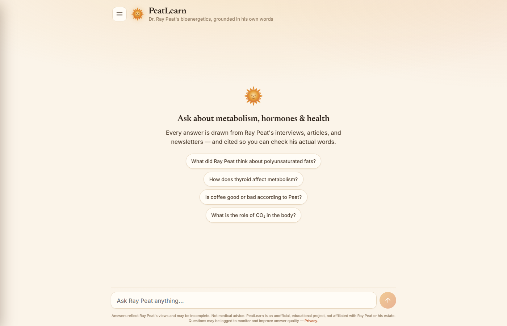

<div align="center">

# 🧬 PeatLearn

**A grounded, citation-backed AI chatbot for exploring Dr. Ray Peat's bioenergetic work.**

Ask questions in plain language and get answers retrieved from a curated corpus of Ray Peat's
transcripts, papers, newsletters, and health writings — with inline citations and source documents.

<br>


[**Live app → peatlearn.com**](https://peatlearn.com)

<br>

<a href="https://peatlearn.com"></a>

</div>

---

## Table of Contents

- [Overview](#overview)
- [What Ships](#what-ships)
- [Quick Start](#quick-start)
- [Setup](#setup)
- [Architecture](#architecture)
- [Tech Stack](#tech-stack)
- [Corpus & Data Pipeline](#corpus--data-pipeline)
- [RAG Quality Benchmark](#rag-quality-benchmark)
- [Testing](#testing)
- [In the Codebase (Not Shipped)](#in-the-codebase-not-shipped)
- [Project Structure](#project-structure)
- [Acknowledgments](#acknowledgments)

---

## Overview

PeatLearn turns a large archive of Dr. Ray Peat's recorded and written work into an interactive,
grounded chatbot. A retrieval-augmented generation (RAG) pipeline answers questions using only the
source corpus, with inline citations and the underlying documents one click away.

The domain is **bioenergetic medicine, nutrition, and hormonal science** — a health-critical
context, so the system is built to ground every claim in the corpus and to **abstain** when the
corpus doesn't support an answer, rather than improvise.

---

## What Ships

The deployed app is a **Vite + React single-page app** served by Caddy, talking to a **FastAPI**
backend (`app/web_api.py`) that runs the RAG pipeline. Both ship as containers via `docker compose`.

| Tab | Description |
|-----|-------------|
| 💬 **Chat** | Ask questions about Ray Peat's work. Answers run through the full multi-stage RAG pipeline (below), are returned with inline citations and relevance-scored sources, and each source has a "Read full document" expander. Benchmark avg **9.64/10**. |
| 🕊️ **Memorial** | A tribute page honoring Dr. Ray Peat. |

> Other components (quizzes, recommender, personalization, knowledge graph, the Streamlit dashboard
> at `app/dashboard.py`, and the standalone `app/api.py` / `app/advanced_api.py` backends) exist in
> the repository but do **not** serve peatlearn.com — see
> [In the Codebase (Not Shipped)](#in-the-codebase-not-shipped).

---

## Quick Start

The whole stack runs from one compose file — no third-party PaaS:

```bash
cp config/env_template.txt .env      # add your API keys
docker compose up --build            # -> http://localhost
```

Frontend dev with hot reload (needs the API running):

```bash
uvicorn app.web_api:app --port 8080
cd web && npm install && npm run dev  # -> http://localhost:5173
```

In production, set `SITE_ADDRESS` and `ACME_EMAIL` in `.env`; Caddy issues HTTPS automatically.

---

## Setup

### Prerequisites

- Python **3.12**
- A **Google Gemini** API key
- A **Pinecone** API key

### Installation

```bash
git clone <repository-url>
cd PeatLearn

python -m venv venv
venv\Scripts\activate
pip install -r requirements.txt
```

### Environment Variables

```bash
cp config/env_template.txt .env
```

Then edit `.env`:

```ini
GEMINI_API_KEY=your_gemini_api_key
PINECONE_API_KEY=your_pinecone_api_key

# Optional — enables the Cohere rerank-4-pro retrieval reranker (recommended in prod).
# Without it, retrieval falls back to the local cross-encoder.
OPENROUTER_API_KEY=your_openrouter_api_key
```

`config/settings.py` (pydantic-settings) is the single source of truth for configuration and reads
these values from `.env`. **Never hardcode API keys.**

### Embeddings

The Pinecone index (`ray-peat-corpus-v3`) is pre-populated with 14,591 native 3072-dim vectors
covering the full corpus, so no local embedding setup is required to run the app.

To pull the local embedding artifacts (optional), set `HF_DATASET_REPO` in `.env` and run:

```bash
python peatlearn/embedding/hf_download.py
```

---

## Architecture

Caddy serves the built React SPA and reverse-proxies `/api` to FastAPI, which calls the RAG
pipeline in `peatlearn/adaptive/rag_system.py`.

```
   ┌────────────────────────────┐
   │   React SPA (Vite)         │   web/  (Chat · Memorial · Privacy · Admin)
   └─────────────┬──────────────┘
                 │  Caddy · HTTPS · /api →
                 ▼
   ┌────────────────────────────┐
   │   FastAPI                  │   app/web_api.py
   └─────────────┬──────────────┘
                 │
                 ▼
   ┌────────────────────────────────────────────────────────────┐
   │   RAG pipeline  (peatlearn/adaptive/rag_system.py)          │
   │                                                            │
   │   query normalize → temporal guard → citation gate →       │
   │   Pinecone two-pass retrieval → reranker → MMR diversity → │
   │   confidence tiers + entity grounding → grounding verifier │
   └─────────────┬───────────────────────────────┬──────────────┘
                 ▼                               ▼
          ┌─────────────┐                 ┌──────────────┐
          │  Pinecone   │                 │   Gemini     │
          │  (vectors)  │                 │ (→ Groq      │
          │             │                 │  fallback)   │
          └─────────────┘                 └──────────────┘
```

---

## Tech Stack

| Layer | Technology |
|-------|-----------|
| Frontend | **Vite + React 18** SPA (`web/`), `react-markdown` · served by Caddy |
| API | **FastAPI** (`app/web_api.py`), containerised via `docker compose` |
| RAG pipeline | `peatlearn/adaptive/rag_system.py` |
| LLM | Google Gemini (`gemini-2.5-flash`, `gemini-2.5-flash-lite`), Groq fallback |
| Embeddings | `gemini-embedding-001` · 3072 dimensions |
| Reranker | Cohere `rerank-4-pro` (via OpenRouter) → local cross-encoder fallback |
| Vector DB | Pinecone · index `ray-peat-corpus-v3` (3072-dim) |
| Language | Python 3.12 |

---

## Corpus & Data Pipeline

The corpus draws from **568 source documents** (2026-05-04 build) spanning Ray Peat's recorded and
written work. The type breakdown below is from the earlier 552-document build:

| Type | Count |
|------|------:|
| Audio transcripts | 188 |
| Academic papers | 96 |
| Health topics | 98 |
| Newsletters | 59 |
| Other | 111 |
| **Total** | **552** |

These are cleaned, chunked, and embedded at 3072 dimensions, then stored in Pinecone.

The 2026-05-04 build funnel: **568 files -> 22,858 raw chunks -> minus 6,329 duplicates -> minus
1,938 quality-gate failures -> 14,591 records** in `ray-peat-corpus-v3`. About 36% of raw chunks
are discarded on purpose. Context coverage 95.6%; chunk length 25 / 89 / 26,521 tokens
(min / median / max).

```
data/raw/  →  preprocessing/cleaning/  →  data/processed/ai_cleaned/
           →  peatlearn/embedding/      →  Pinecone (ray-peat-corpus-v3)
```

- **Tier 1 (~27%)** — rules-based cleaning for already-clean documents.
- **Tier 2 (~73%)** — AI-powered cleaning: OCR correction, speaker attribution, and segmentation.

---

## RAG Quality Benchmark

The chatbot is evaluated against a fixed **55-question benchmark** across 9 categories (including
`adversarial` and `colloquial_user`), with dual scoring: LLM-as-judge (Gemini 2.5-flash on a
**6-dimension weighted rubric**) **plus** automated metrics that need no judge (citations, vocabulary
hit rate, source diversity, topic coverage, abstention-signal matching).

| Rubric dimension | Weight |
|---|---:|
| accuracy | 0.25 |
| grounding | 0.25 |
| completeness | 0.15 |
| refusal_appropriateness | 0.15 |
| domain_fluency | 0.10 |
| attribution_style | 0.10 |

`refusal_appropriateness` was added in the v2 rubric to measure adversarial defence; its weight came
out of accuracy, domain_fluency and attribution_style (0.05 each). Every question carries an
`expected_behavior` label (`answer` / `abstain` / `reject_premise`), so refusal correctness is scored
mechanically as well as judged.

**Retrieval pipeline:** queries run through vocabulary normalization → two-pass Pinecone retrieval →
a tiered reranker → MMR diversity → confidence-gated abstention. The reranker tries
**Cohere `rerank-4-pro`** (via OpenRouter) first, then falls back to a local cross-encoder
(`peat-reranker-ft` if present, otherwise `ms-marco-MiniLM-L-6-v2`), and finally to keyword overlap.

```bash
python scripts/eval/eval_rag_quality.py               # full 55-question run
python scripts/eval/eval_rag_quality.py --subset A,B  # only specific categories
python scripts/eval/eval_rag_quality.py --no-judge    # automated metrics only
```

The question set lives in `data/eval/questions.json`; results are written to
`data/eval/results_<timestamp>.json`. See `data/eval/README.md` for the full rubric.

### Score history

| Date | Score | Notes |
|------|------:|-------|
| commit `ed84cf1` | 8.60 / 10 | Baseline — HyDE + two-pass Pinecone + MMR diversity |
| `057580e` | — | **HyDE removed** — built, measured, disabled: the raw query retrieved better |
| 2026-04-11 | 8.95 / 10 | +0.35 — cross-encoder rerank (`ms-marco-MiniLM-L-6-v2`) + MMR fix |
| 2026-04-14 | 9.05 / 10 | +0.10 — dynamic `max_sources` heuristic + three-tier prompt depth |
| 2026-05-16 | **9.64 / 10** | +0.59 — swapped reranker to **Cohere `rerank-4-pro`** (A/B win over local MiniLM, 9.64 vs 9.42) |

**Per-category & per-dimension breakdown** (from the 9.05 judged run, 30/30, pre-Cohere reranker):

| Category | Score | | Rubric dimension | Score |
|----------|------:|---|------------------|------:|
| core_bioenergetics | 9.11 | | accuracy | 9.47 |
| disease_clinical | 9.20 | | grounding | 9.18 |
| cross_concept | 9.07 | | attribution_style | 9.05 |
| hormones_endocrine | 9.05 | | domain_fluency | 8.72 |
| edge_ambiguous | 9.05 | | completeness | 8.37 |
| edge_nuanced | 9.03 | | | |
| nutrition_foods | 8.86 | | | |

Automated metrics: **source diversity 0.91** · expected-topic coverage 0.76 ·
100% of answers returned ≥ expected sources · avg **5.3 inline citations** per answer.

---

## Testing

```bash
pytest tests/              # all tests
pytest tests/unit/         # unit tests only
pytest tests/integration/  # integration tests only
```

Run from the project root. Tests import from the `peatlearn.*` package — no `sys.path` hacks.

---

## In the Codebase (Not Shipped)

The repository contains additional components that are **not part of the live app**. They are kept
for local development and future work — do not treat them as current features:

- **FastAPI backends** — `app/api.py` (RAG, port 8000) and `app/advanced_api.py` (ML, port 8001).
  Useful for local development; the production deploy runs `app/dashboard.py` directly without them.
- **Adaptive quizzes** — `QuizGenerator` exists but is not wired into the UI (Quiz tab parked).
- **Personalized recommendations** — matrix factorization recommender and RL content selector exist
  as code/artifacts, not user-facing.
- **Learning profiles / analytics** — parked tabs.
- **Topic model** — TF-IDF + KMeans clustering over the corpus, not surfaced in the live UI.
- **Knowledge graph** — concept-map work, parked.

---

## Project Structure

```
peatlearn/               ← importable package (project root on PYTHONPATH)
  rag/                   ← PineconeVectorSearch, PineconeRAG, reranker, confidence
  adaptive/              ← rag_system.py (live RAG pipeline) + parked: QuizGenerator, topic model
  personalization/       ← engine, RL agent, knowledge graph  (not shipped)
  embedding/             ← CorpusEmbedder, HuggingFace sync
  recommendation/        ← matrix factorization trainer       (not shipped)
app/
  web_api.py             ← live FastAPI backend (serves the React SPA's /api)
  dashboard.py           ← Streamlit dashboard (dev/local only, not in production)
  api.py / advanced_api.py ← FastAPI backends (local dev only)
config/                  ← settings.py (pydantic-settings, reads .env)
preprocessing/           ← cleaning pipeline + quality analysis
scripts/                 ← utility runners (launch, setup, eval)
tests/
  unit/                  ← unit tests
  integration/           ← integration tests
data/
  raw/                   ← source xlsx, pdfs, txts (source of truth — never mutate)
  processed/             ← AI-cleaned chunks
  embeddings/            ← local .npy/.pkl vector files
  models/                ← topic model & MF model artifacts
  user_interactions/     ← SQLite DB
```

---

## Acknowledgments

- **Dr. Ray Peat** — for his pioneering work in bioenergetic medicine.
- **The Ray Peat community** — researchers and enthusiasts who keep his ideas alive.

<div align="center">

<br>

*"Energy and structure are interdependent at every level."*
— Ray Peat

</div>
